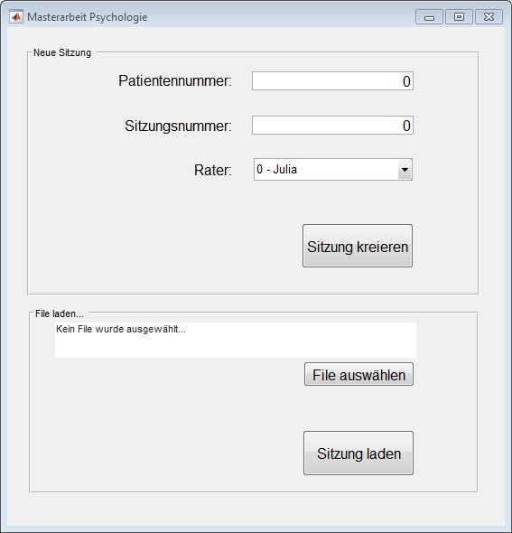
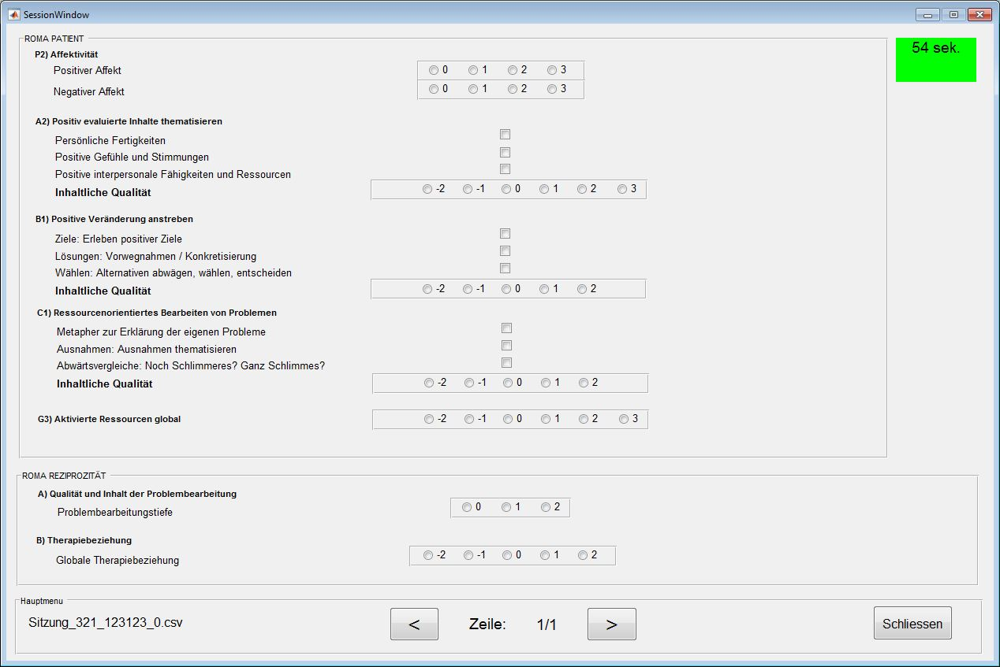

# Video Evaluation Tool

This is a small MATLAB project to help psychology students rate and evaluation videos according to specific criterias more efficiently.
Results are store in a CSV file without headers using CSVWRITE in Matlab.

This project was made originally for the master thesis of Manuela and Julia in General Psychology at the University of Zurich.

## Getting Started

You only need to download the project to your prefered folder and in MATLAB navigate to that folder and execute

```
startSession
```

### Prerequisites

- MATLAB
- (optional) Motivation to adapt the project to suit your needs.

### Preview





### Pre-Programmed Questions

- Affektivität
- Positiv evaluierte Inhalte thematisieren
- Positive Veränderungen anstreben
- Ressourcenorientiertes Bearbeiten von Problemen
- Aktivierte Ressourcen
- Problemtiefe
- Arbeitsbeziehung